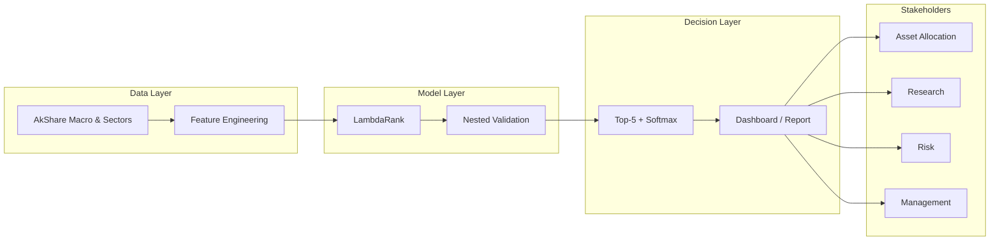

# Business Analytics · Sector Rotation Decision Support

> This document translates the quantitative research into a business-facing analytics deliverable: stakeholder mapping, operating model, decision rules, and portfolio-ready artefacts.

**Related documents:** [Research Report](REPORT.md) · [Data Pipeline](PIPELINE.md) · [Dashboard](../run_dashboard.py)

---

## 1. Business Problem

Asset allocation and research teams face the same monthly question:

> **Which Shenwan Level-1 sectors should be overweight next month, and in what proportions?**

Traditional approaches rely on discretionary judgement or a single momentum rule. This system provides a reproducible alternative:

| Dimension | Conventional Practice | This System |
|-----------|----------------------|-------------|
| Objective | Absolute return guess | **Cross-sectional ranking** |
| Validation | In-sample fit | **Nested walk-forward** (leakage-controlled) |
| Weighting | Equal-weight Top-N | **Softmax(score)** reflecting model confidence |
| Rationale | Opaque | SHAP attribution + regime diagnostics |
| Benchmarking | Ad hoc | Momentum / PMI rule / random / index |

---

## 2. Key Performance Indicators

Out-of-sample window: **February 2023 – May 2026** (40 months).

| KPI | Value | Business Reading |
|-----|-------|------------------|
| Net Annual Return | 10.6% | Positive after transaction costs |
| Sharpe Ratio | 0.47 | Risk-adjusted outperformance vs CSI 300 (0.25) |
| Rank IC | 0.071 | Statistically meaningful but modest ranking signal |
| Top-5 Hit Rate | 25.5% | Above random baseline (~18.5%) |
| Max Drawdown | −25.2% | Requires regime-aware position sizing |

**Assessment.** The model provides preliminary evidence of ranking ability. It does not outperform the 12-month momentum Top-5 rule (Sharpe 0.53). The appropriate business positioning is **research support and risk governance**, not a standalone alpha engine.

---

## 3. Stakeholder Value Map



| Role | Pain Point | Value Delivered | Artefact |
|------|-----------|-----------------|----------|
| Asset Allocation | Sector rotation lacks quantitative basis | Monthly ranking + weight proposal | Dashboard · Executive Overview |
| Research | Factor efficacy hard to audit | IC, IC decay, SHAP case studies | Research Report §5 |
| Risk | Strategy failure in adverse regimes | Conditional failure rates by regime | Error Analysis tables |
| Management | Strategy credibility | Transparent multi-benchmark comparison | Benchmark table · Static dashboard |

---

## 4. Monthly Operating Model

### 4.1 Timeline

| Timing | Action | Owner | Output |
|--------|--------|-------|--------|
| Month-start (T+0) | Refresh market and macro data | Data | `run_phase1.py` |
| T+1 | Retrain model and generate forecast | Quant research | `run_ml.py` |
| T+2 | Review dashboard and SHAP case study | Research | Decision memo |
| T+3 | Allocation committee review | Investment committee | Rebalance / hold |
| T+4 | Execution and position reconciliation | Trading | Holdings log |

### 4.2 Decision Memo Template

```markdown
# Sector Rotation Memo — YYYY-MM

## 1. Model Recommendation (LambdaRank + Softmax)
| Rank | Sector | Score | Weight |
|------|--------|-------|--------|
| 1 | ... | ... | ...% |

## 2. Signal Health
- 3-month rolling Rank IC: ...
- IC decay (1M → 2M): ...
- Current regime: ...

## 3. Benchmark Cross-Check
- 12M Momentum Top-5: ...
- Overlap with model: X/5

## 4. Risk Flags
- If weak momentum + low volatility: reference 2023 failure rate

## 5. Decision
- [ ] Follow model  [ ] Follow momentum  [ ] Hold  [ ] Reduce exposure
```

---

## 5. Decision Playbook

### 5.1 When to Trust the Model

| Condition | Recommended Action | Evidence |
|-----------|-------------------|----------|
| 3-month rolling Rank IC > 0 | Normal implementation | `model_comparison_primary.csv` |
| Strong momentum regime | May increase active weight | `error_analysis_summary.csv` |
| Weak momentum + low volatility | Reduce exposure 50% or switch to momentum | 2023 failure rate ~73% |
| Rank IC negative for 3 consecutive months | Pause and review | Monthly IC series |
| 2-month IC decay < 0 | Maintain monthly cadence; do not extend holding | `ic_decay_summary.csv` |

### 5.2 Relationship to Momentum Rules

The 12-month momentum Top-5 achieves a higher Sharpe in the current sample. A pragmatic combined approach:

1. **Double-weight** sectors appearing in both model and momentum Top-5
2. **Half-weight** sectors unique to the model
3. **Default to momentum** in weak-momentum months

This is not a concession of model failure; it is a transparent business rule for allocating trust between ML and heuristic benchmarks.

---

## 6. Deliverables for Portfolio / GitHub

### 6.1 Interactive Dashboard

```bash
pip install -r requirements.txt
python run_ml.py
python run_dashboard.py   # http://localhost:8501
```

Seven pages: Executive Overview · Market Environment · Sector Intelligence · Explainable AI · Portfolio Performance · Model Evaluation · Data Pipeline.

### 6.2 Word Business Report

```bash
python generate_word.py
# → docs/REPORT.docx
```

Formal business report with applied conclusion, OOS evidence, and embedded charts.

### 6.3 Recommended Repository Layout

```
README.md
docs/
  REPORT.md
  BUSINESS_ANALYTICS.md
  PIPELINE.md
src/
scripts/validate_pipeline.py
config/config.yaml
.github/workflows/ci.yml
```

---

## 7. Cost and Return Profile

| Item | Estimate |
|------|----------|
| Data cost | ¥0 (AkShare public data) |
| Compute | Local CPU; `run_ml.py` ~10–20 minutes per run |
| Monthly labour | Data refresh 0.5h + review 1h + committee 0.5h |
| Alternative value | Auditable decision record; reduced discretionary dispute |

---

## 8. Limitations and Compliance

1. **Not investment advice.** Research prototype; OOS sample ~40 months.
2. **Does not beat momentum benchmark.** Position as decision support, not primary alpha.
3. **Public-data constraint.** Information set narrower than institutional databases.
4. **No live slippage modelling.** Backtest assumes monthly rebalancing at uniform transaction cost.

---

## 9. Product Roadmap

| Priority | Feature | Business Value |
|----------|---------|----------------|
| P1 | Integrate feature selection into training | Improved generalisation |
| P1 | Model × momentum blended weights | Potential Sharpe uplift |
| P2 | Prediction uncertainty bands | Tiered position sizing |
| P2 | Automated monthly report distribution | Operational efficiency |
| P3 | Fundamental factors (Wind/Tushare) | Value / earnings dimension |

---

*Document version: 10 July 2026 · Aligned with Research Report and pipeline outputs*
