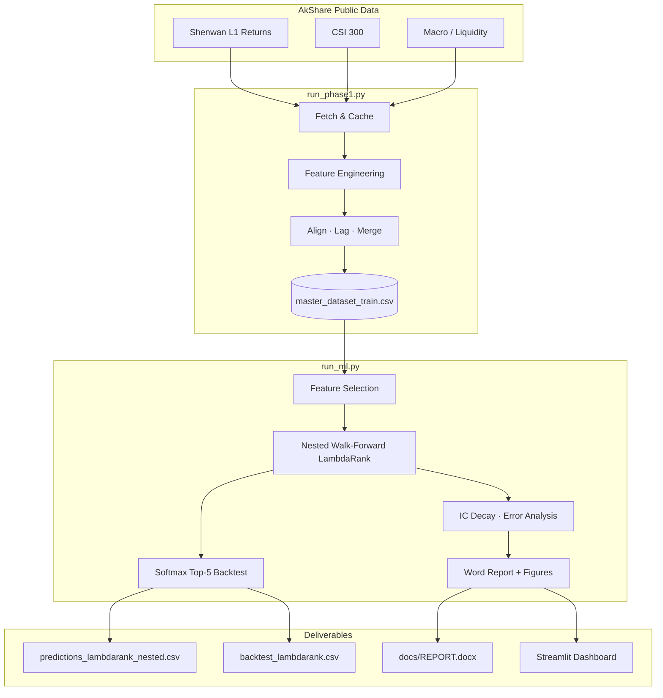

# Data Pipeline

> End-to-end data flow, schema, and reproducibility guide.

**Related:** [Research Report](REPORT.md) · [Business Analytics](BUSINESS_ANALYTICS.md)

---

## Overview



---

## Phase 1 — Data & Features

| Item | Detail |
|------|--------|
| Entry | `python run_phase1.py [--skip-fetch]` |
| Runtime | ~2–5 min |
| Output | `data/processed/master_dataset_train.csv`, `features_standardized.csv` |

Steps: fetch raw CSVs → build macro/liquidity/market/sector factors → align to month-start with publication lags → write training panel.

Raw data is cached under `data/raw/` (gitignored). Re-fetch with `python run_phase1.py`.

---

## Phase 2 — Modelling & Backtest

| Item | Detail |
|------|--------|
| Entry | `python run_ml.py` |
| Runtime | ~10–20 min |
| Model | LambdaRank + nested walk-forward validation |

Key outputs under `data/processed/ml/`:

| File | Content |
|------|---------|
| `predictions_lambdarank_nested.csv` | Monthly sector rankings + actual returns |
| `backtest_lambdarank.csv` | Portfolio NAV, holdings, weights |
| `model_comparison_primary.csv` | Primary strategy KPIs |
| `benchmark_comparison.csv` | Multi-benchmark comparison |
| `analysis/ic_decay_summary.csv` | 1/2/3-month IC decay |

Also generates `docs/REPORT.docx` and charts under `data/figures/ml/`.

---

## Phase 3 — Delivery

| Command | Output |
|---------|--------|
| `python run_dashboard.py` | Streamlit UI (`:8501`) |
| `python generate_word.py` | `docs/REPORT.docx` |
| `python run_all.py` | Full pipeline |

---

## Reproducibility

```bash
python3 -m venv .venv && source .venv/bin/activate
pip install -r requirements.txt
python run_phase1.py --skip-fetch   # or full fetch
python run_ml.py
python run_dashboard.py
```

Configuration: `config/config.yaml`

---

## Project Layout

```
public-data-sector-rotation/
├── config/config.yaml
├── run_phase1.py
├── run_ml.py
├── run_dashboard.py
├── run_all.py
├── generate_word.py
├── src/{fetch,preprocess,ml,dashboard,report}
├── scripts/validate_pipeline.py
├── docs/{REPORT.md,BUSINESS_ANALYTICS.md,PIPELINE.md}
└── data/{raw,processed,figures}
```

Processed data and figures are gitignored — run the pipeline locally after cloning.
